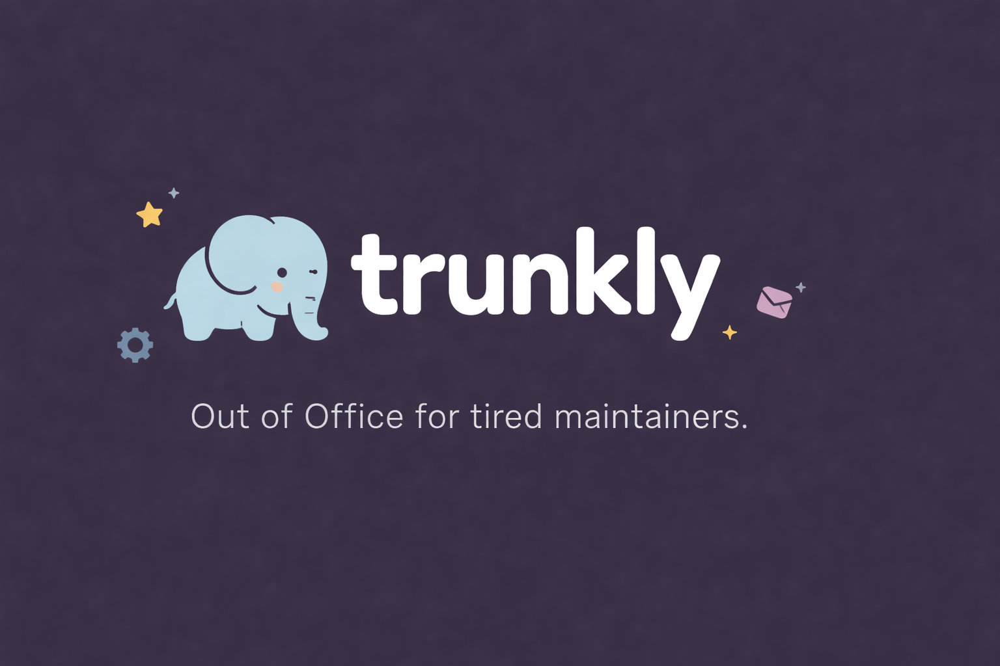
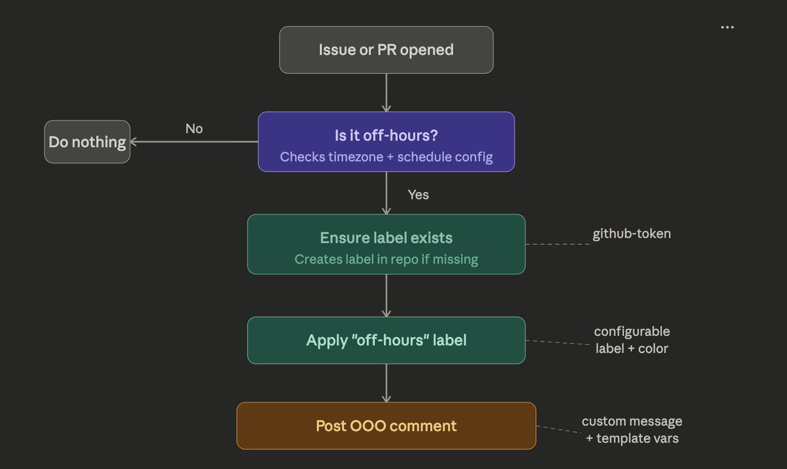
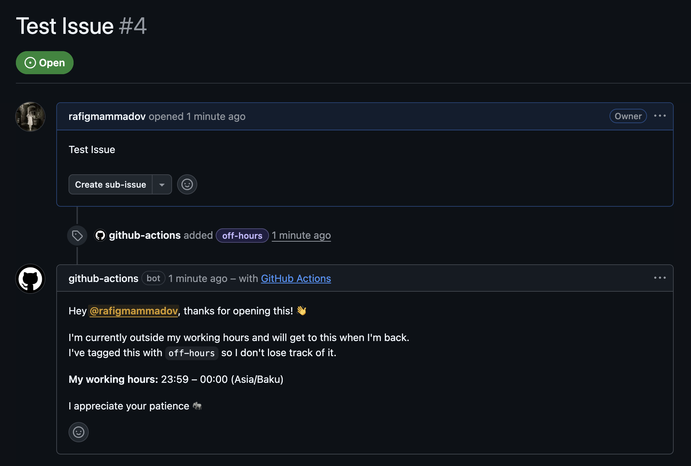

# Trunkly 🐘

> **Out of Office assistant for tired maintainers.**
> Automatically labels issues and pull requests opened during your off-hours, and posts a friendly "I'll get to this later" comment. No burnout, just boundaries.

[](https://github.com/rafigmammadov/trunkly/actions/workflows/ci.yml)
[](https://github.com/marketplace/actions/trunkly)
[](LICENSE)

---



---

## Why

Maintainers get pinged at all hours. Sometimes a polite "I'm offline, I'll look at this tomorrow" is all you need to reduce anxiety — yours *and* the contributor's. Trunkly does that automatically, hands-free.

## How it works



---

## What it looks like

When someone opens an issue or PR during your off-hours, they see this:



And the label gets applied automatically:


---

## Quickstart

Create `.github/workflows/trunkly.yml` in your repo:

```yaml
name: Trunkly OOO

on:
  issues:
    types: [opened]
  pull_request:
    types: [opened]

jobs:
  ooo:
    runs-on: ubuntu-latest
    steps:
      - uses: rafigmammadov/trunkly@v1
        with:
          timezone: "America/New_York"
          off-hours-start: "18:00"
          off-hours-end: "09:00"
          off-days: "Saturday,Sunday"
```

That's it. Trunkly will:

1. Check if it's currently your off-hours in your timezone
2. Create the label if it doesn't exist yet
3. Apply the label to the issue or PR
4. Post a friendly comment letting the author know you'll be back

---

## All inputs

| Input | Required | Default | Description |
|---|---|---|---|
| `github-token` | No | `${{ github.token }}` | Token with `issues: write` and `pull-requests: write` |
| `timezone` | No | `UTC` | IANA timezone, e.g. `Europe/London`, `Asia/Tokyo` |
| `off-hours-start` | No | `18:00` | Start of off-hours in HH:MM (24h) |
| `off-hours-end` | No | `09:00` | End of off-hours in HH:MM (24h) |
| `off-days` | No | `Saturday,Sunday` | Comma-separated days that are always off |
| `label` | No | `off-hours 🌙` | Label to apply |
| `label-color` | No | `7057ff` | Hex color for the label (no `#`) |
| `label-description` | No | `Opened outside of maintainer working hours.` | Label description |
| `comment` | No | *(see below)* | Comment template — supports `{author}`, `{label}`, `{start}`, `{end}`, `{timezone}`, `{type}`, `{number}`, `{title}` |
| `skip-authors` | No | `` | Comma-separated usernames to never process (e.g. `dependabot[bot]`) |
| `skip-label` | No | `` | Skip processing if item already has this label |
| `dry-run` | No | `false` | Log actions without posting or labeling |

### Default comment

```
Hey @{author}, thanks for opening this! 👋

I'm currently outside my working hours and will get to this when I'm back.
I've tagged this with `{label}` so I don't lose track of it.

**My working hours:** {end} – {start} ({timezone})

I appreciate your patience 🐘
```

---

## Examples

### Custom message

```yaml
- uses: rafigmammadov/trunkly@v1
  with:
    timezone: "Europe/Amsterdam"
    off-hours-start: "17:30"
    off-hours-end: "08:30"
    comment: |
      Hi @{author}! 👋 Thanks for the {type}.

      I'm currently AFK — I work **{end}–{start} CET** on weekdays.
      I've labelled this as `{label}` and will review it when I'm back online.

      If it's urgent, please say so and I'll try to prioritise it.
```

### Weekdays only, no weekends

```yaml
- uses: YOUR_USERNAME/trunkly@v1
  with:
    timezone: "Asia/Tokyo"
    off-hours-start: "20:00"
    off-hours-end: "10:00"
    off-days: "Saturday,Sunday"
```

### Skip bots

```yaml
- uses: rafigmammadov/trunkly@v1
  with:
    timezone: "America/Los_Angeles"
    skip-authors: "dependabot[bot],renovate[bot],github-actions[bot]"
```

### Custom label color

```yaml
- uses: rafigmammadov/trunkly@v1
  with:
    timezone: "America/Chicago"
    label: "reviewed later 🌙"
    label-color: "0075ca"
```

### Dry run — test it safely first

```yaml
- uses: rafigmammadov/trunkly@v1
  with:
    timezone: "America/Chicago"
    dry-run: "true"
```

---

## How off-hours detection works

Trunkly evaluates **two conditions** — either one triggers the OOO response:

1. **Off-days**: If today (in your timezone) is listed in `off-days`, it's always treated as off-hours regardless of the time.
2. **Time window**: If the current time (in your timezone) falls between `off-hours-start` and `off-hours-end`. This correctly handles **midnight-crossing windows** like `22:00`–`07:00`.

---

## Permissions

The default `${{ github.token }}` works for most repos. If you use a fine-grained personal access token, it needs:

- `issues: write` — to add labels and post comments on issues
- `pull-requests: write` — to add labels and post comments on PRs
- `metadata: read` — required for org repos

---

## Timezone reference

Use any [IANA timezone name](https://en.wikipedia.org/wiki/List_of_tz_database_time_zones). Common examples:

| Timezone | IANA name |
|---|---|
| US Eastern | `America/New_York` |
| US Pacific | `America/Los_Angeles` |
| UK / Ireland | `Europe/London` |
| Central Europe | `Europe/Berlin` or `Europe/Paris` |
| India | `Asia/Kolkata` |
| Japan | `Asia/Tokyo` |
| Australia Eastern | `Australia/Sydney` |
| Azerbaijan / Baku | `Asia/Baku` |

---

## Contributing

Pull requests welcome! See [CONTRIBUTING.md](CONTRIBUTING.md).

---

## License

MIT © [Rafig Mammadov](https://github.com/rafigmammadov)